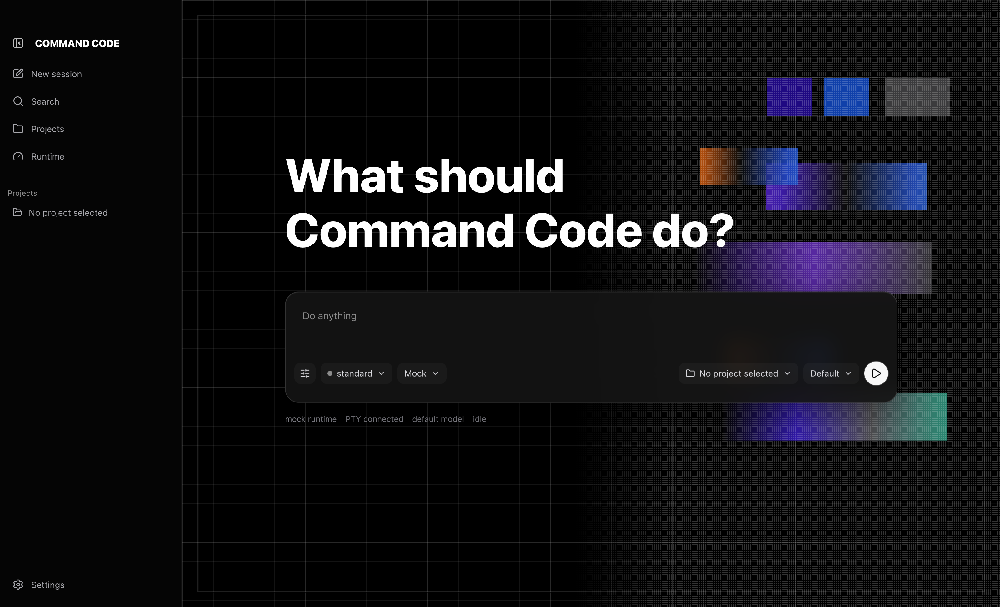
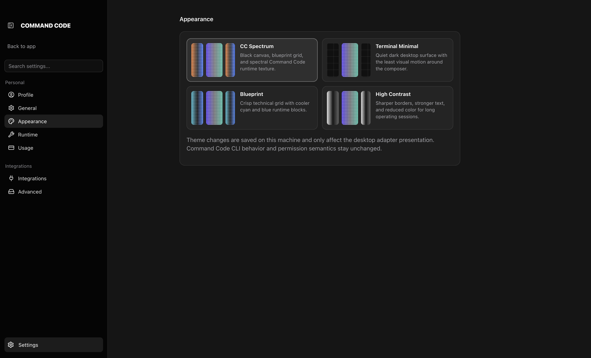
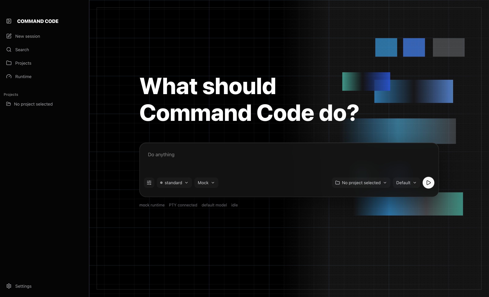

# Command Code

Command Code is a native-feeling desktop workbench for a terminal-first coding agent.

It keeps Command Code CLI as the execution engine, then adds the parts that make daily operation easier: a calm composer, project picker, visible permission modes, PTY health, session tabs, headless runs, transcripts, runtime diagnostics, and settings that feel like a desktop app instead of a stack of command-line flags.



## Why This Exists

Command Code is powerful as a CLI and as a headless harness. That power also creates friction for normal use: operators need to remember command flags, choose code locations, understand when a real PTY is healthy, and keep risky permission states visible while work is running.

This app turns that workflow into a small desktop cockpit:

- **Start from intent:** type what you want done, then pick project, session surface, model, and access from the composer row.
- **Keep the CLI honest:** interactive work runs through a PTY, and one-shot automation runs through `cmd --print`.
- **Make risk visible:** `standard`, `auto-accept`, and `trust` access states stay on-screen instead of being hidden in configuration.
- **Support headless work:** run non-interactive prompts from the GUI while preserving receipts and exit status.
- **Expose health:** PTY, auth, IDE, model, and command binary checks are inspectable without scraping terminal output.
- **Keep Command Code current:** startup performs a read-only `cmd update --check-only`, and the sidebar Update chip runs `cmd update` only when the operator clicks it, then verifies the installed state with a follow-up check.
- **Surface important releases:** known Command Code patch notes appear in-app after update checks or completed updates, with direct access to relevant slash commands.

This is intentionally an adapter, not a fork. The GUI does not own model semantics, tool permissions, taste learning, checkpoint internals, or private Command Code APIs. Command Code remains the engine and source of execution truth.

## Dogfood Story

This interface was created predominantly with **DeepSeek running through Command Code's harness**, then refined with **Codex** for UX polish, documentation, validation, and packaging checks.

That matters because the app is not just a wrapper around a CLI. It is a proof loop for the thing it presents: a headless/terminal agent can help build the native surface that makes the same agent easier to use. The result is a desktop UI that preserves the CLI's power while reducing the operator burden around session setup, runtime mode, and safety visibility.

## Screenshots

Appearance themes are selectable from Settings so the app can keep the Command Code visual identity without forcing a single high-intensity presentation.



The default theme uses the Command Code spectral grid. The Blueprint theme keeps the same layout but cools the color system for longer work sessions.



## What Is Included

- Electron + React + TypeScript desktop shell
- PTY-backed interactive Command Code session runner
- Headless `cmd --print` runner for non-interactive jobs
- Mock mode so the interface can be explored before Command Code is installed
- Composer-first new session flow with project, model, and permission chips
- Real sessions by default when PTY is healthy, with Mock kept as Demo mode
- Grouped command palette for `/plan`, `/design surface`, `/configure-models`, `/agents`, `/skills`, `/mcp`, `/usage`, and headless `cmd --print`
- Model picker with local favorite models, per-project model persistence, and task model routing through `/configure-models`
- Project-state reference for `.commandcode` commands, skills, taste, memory, GUI preferences, and existing Command Code chat contexts
- Click existing project contexts to resume them through Command Code's own `cmd --resume <session-title-or-id>` path, with chat history visible in the right inspector
- Settings page with profile, runtime, appearance, usage, integrations, hooks, MCP, agents, skills, memory, taste, notifications, terminal, keyboard, data, and advanced diagnostics sections
- Selectable appearance themes with local persistence
- Runtime checks for CLI, PTY health, and available Command Code updates
- Codex-like conversation workspace for active sessions, with live PTY output projected into a full-page native timeline by default; follow-up prompts append as separate chat turns, while raw xterm is hidden under Advanced session tools for diagnostics and unsupported TUI states
- Native stream telemetry for active sessions: command identity, input/output chunk and byte counts, last stream event age, stream freshness, exit state, and transcript write errors are shown from the GUI-owned PTY/WebSocket layer without inventing Command Code-internal state
- Workbench rail for IDE/Finder, environment status, repo terminal, and right sidebar controls
- Right inspector for files, file preview, transcript/history, docs, environment status, and IDE status, with gated workbench actions kept preview-only until their route contracts are explicit
- `Cmd+T` / `Ctrl+T` opens another Command Code session in the same selected project
- The composer is the primary prompt surface; Enter sends and Shift+Enter inserts a line break. Command Code selection prompts can render as inline approval buttons, while advanced terminal input remains available only from the diagnostic fallback. The header Terminal button opens a separate shell in the repo for commands like `npm run dev`
- `Ctrl/Cmd+O` or `Ctrl/Cmd+0` toggles the active session thinking/transcript details in the right inspector, scoped to the current live session
- Chat bubbles use translucent black surfaces with theme-aware user and CC accents; Appearance settings can override each accent color locally
- Resizable left sidebar and right inspector, with collapse when dragged below the useful width
- Product icon assets for macOS, Windows, and Linux packaging

## Prerequisites

```bash
npm i -g command-code
cmd --version
cmd status --json
```

On Windows, the executable name `cmd` can collide with the Windows command shell. If the app launches the wrong binary, set the command binary in Settings to the full npm shim path or to another working Command Code binary name if your installation exposes one.

## Run

```bash
npm install
npm run dev
```

Use **Demo mode** first if you only want to validate the GUI. The normal composer path starts a **Real session** when a project directory is selected, `cmd --version`, `cmd status --json`, and the PTY health check pass. Headless work is available from the command palette as **Run headless**, which executes `cmd --print` and records the result in history. Runtime commands now require an explicit project directory; the GUI does not silently fall back to your home directory when project context is missing.

On launch, the app checks for Command Code CLI updates with `cmd update --check-only`. This is intentionally non-mutating. Use the Update chip in the lower-left sidebar to run `cmd update` when an update is available, or to manually refresh update status. After an update run completes, the app performs a follow-up `cmd update --check-only` so the chip reflects the installed state rather than stale update output.

Release notes are presented through the same local modal every time. Curated notes are bundled for known versions, including Command Code `0.32.3` for `/configure-models` and `0.33.2` for Web Search/Web Fetch. If future CLI update output includes note-like text, the GUI formats that into the modal; if no note text is exposed, completed updates still get a consistent generated receipt and the raw output remains visible in Settings → About.

The release-note modal is driven by the actual installed version returned from `cmd update --check-only`; it is not a separate hardcoded marketing surface. The copy is local release metadata keyed by version, and dismissal is saved in local storage.

## Project State And Chat Contexts

The app treats `.commandcode` as a canonical project signal, but keeps ownership boundaries explicit:

- `<project>/.commandcode/commands/` contains repo-local Command Code command prompts.
- `<project>/.commandcode/skills/` contains repo-local skill definitions.
- `<project>/.commandcode/taste/` contains project taste notes owned by Command Code semantics.
- `<project>/.commandcode/memory/` contains optional project memory files surfaced by the GUI memory editor.
- `<project>/.commandcode/gui-preferences.json` is GUI-owned adapter state for model, runtime, access, and appearance choices.
- `~/.commandcode/gui-preferences.json` is GUI-owned app state for the last selected project, recent projects, command binary, model defaults, appearance, dismissed release notes, and sidebar/inspector widths. This file is what keeps `npm run dev` from forgetting state when Electron starts the local server on a new port.
- `~/.commandcode/projects/<project-slug>/` contains Command Code runtime-owned chat contexts, metadata, checkpoints, and settings.

Settings → Data and Advanced → Project state show these locations and the files found in each section. Existing project chat contexts appear in the sidebar as recent chats, initially capped with Show more. Selecting one immediately starts a real Command Code PTY with `cmd --resume <session-title-or-id>` in the main conversation workspace; the prior transcript/history remains available from the right inspector when opened explicitly. The GUI does not append directly to runtime-owned `.jsonl` transcript or checkpoint files.

Live `.ansi` PTY recordings are diagnostic tails, not the source for native chat history. The transcript inspector renders `.jsonl` files as structured timelines and shows compacted, bounded PTY tails for raw terminal diagnostics so terminal repaint output does not become a wall of JSON parse errors or repeated thinking/progress frames.

Active-session stream telemetry is adapter-owned instrumentation. It reports what the GUI can prove about the PTY/WebSocket path: command, arguments, project, input/output byte and chunk counts, last input/output timestamp, stream freshness, transcript write errors, and exit state. It does not replace structured Command Code transcripts or infer private agent state from terminal output.

Workbench file mutations, IDE actions, git mutations, terminal lifecycle/profile changes, editable theme-token controls, and release-fetching behavior are gated in `docs/reports/WORKBENCH_POLISH_GATE.md`. Settings → Data surfaces those gates as preview-only status instead of exposing unscoped actions.

## Localhost Browser Mode

For operators who do not want to run the Electron shell, Command Code can run as a localhost web UI against the same guarded local bridge. After the package is published to npm, the one-line path is:

```bash
npx command-code-gui@latest serve --open
```

The server binds to `127.0.0.1`, prints an auth token, and opens a tokenized URL when `--open` is provided. The browser UI uses the same PTY/session/headless endpoints as the desktop shell.

From a source checkout, the equivalent command is:

```bash
npm run serve -- --open
```

Useful localhost commands:

```bash
npx command-code-gui@latest doctor
npx command-code-gui@latest serve --port 5183 --open
npx command-code-gui@latest serve --dir /path/to/out/renderer
```

## Build And Package

```bash
npm run build
npm run dist
```

Native packages such as `node-pty` may need an Electron rebuild on some systems:

```bash
npm rebuild node-pty --runtime=electron --target=$(node -p "require('electron/package.json').version") --disturl=https://electronjs.org/headers
```

For unsigned macOS packaging checks during local development:

```bash
CSC_IDENTITY_AUTO_DISCOVERY=false npx electron-builder --dir --config.npmRebuild=false
```

For npm packaging checks:

```bash
npm pack
npx --package ./command-code-gui-0.1.0.tgz ccgui doctor
```

## Architecture

```text
Renderer React UI
  ├─ composer, settings, drawers, session tabs
  ├─ xterm.js terminal surface
  └─ project/model/mode/permission controls
        │ secure IPC only
        ▼
Preload bridge
        │ validates channel shape, no node integration
        ▼
Electron main process / local server
  ├─ PTY SessionManager -> cmd [interactive]
  ├─ child_process runner -> cmd --print [headless]
  ├─ command-code doctor/status/list-models/update helpers
  └─ guarded external links + directory picker
        │
        ▼
Installed Command Code CLI
```

## Design Decisions

- **Do not parse the TUI as the source of truth.** The live conversation view is a presentation projection over PTY text. Structured state still comes only from stable CLI/API surfaces, and the raw terminal remains available for exact Command Code interaction.
- **Treat headless and interactive as separate paths.** Headless is clean for automation; interactive sessions need a real PTY.
- **Keep permissions explicit.** Risky access states should be visible in the composer and active-session header.
- **Fail closed.** The renderer does not get broad shell capability. Main process spawning is scoped to the configured Command Code binary and controlled arguments.
- **Keep desktop comfort separate from runtime ownership.** Settings, themes, and project pickers improve operation without changing Command Code semantics.
- **Persist local preferences without owning runtime semantics.** Renderer storage is used as a fast client cache, while selected project preferences are mirrored to `<project>/.commandcode/gui-preferences.json` so a project can signal its preferred GUI model, runtime surface, and safety defaults.

## Validation

```bash
npm run typecheck
npx vitest run
npm run build
npm run smoke:browser
npm run smoke:headless
npm run smoke:pty
```

## Docs

All documentation lives under `docs/`. See [docs/INDEX.md](docs/INDEX.md) for the full index.

| Section | Contents |
|---|---|
| [Architecture](docs/architecture/) | App architecture, cross-platform strategy, security |
| [Guides](docs/guides/) | Visual design style guide |
| [Reference](docs/reference/) | CLI reference, component reference, known limitations |
| [Reports](docs/reports/) | Smoke test reports, hardening gates, test plans |
| [Contributors](docs/contributors/) | V1 implementation guide, package loop, validation gates |
| [Roadmap](ROADMAP.md) | Implementation plan and remaining work |
